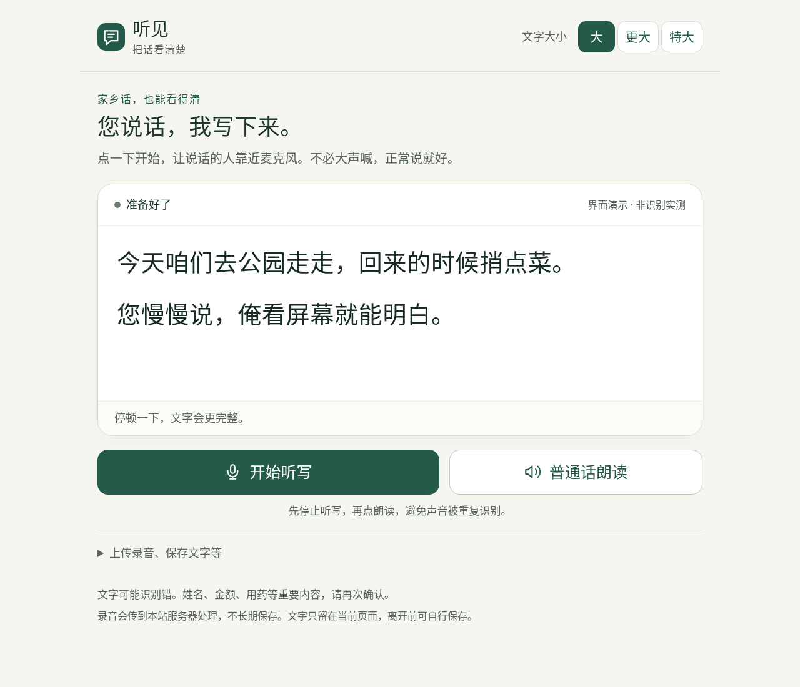

# 听见 · 把话看清楚

**面向听障长者的服务器语音转写与普通话朗读工具。** 手机、平板或电脑通过公网 HTTPS 打开；计算在自己的服务器，客户端不用安装模型。

[](https://github.com/ZichenX/tingjian/actions/workflows/ci.yml)
[](LICENSE)

本仓库是一个可以从源码复现的单机服务：后端、网页、部署脚本、模型下载器、真实模型验收脚本和测试都在仓库内；模型权重、访问码、`.env`、用户录音和运行时报告不会提交到 Git。首次部署必须阅读 [模型许可与来源](MODEL_LICENSES.md) 和 [可复现部署手册](docs/REPRODUCIBLE_DEPLOYMENT.md)。

默认路线：**Silero VAD → FireRedASR2 CTC 临时预览 → AED 停顿后定稿**；可切换 Fun-ASR-Nano、SenseVoice 或单 CTC/AED。普通话朗读使用 **MeloTTS ONNX**，无需外部语音 API 或 GPU。

> 交付状态：完整源码、部署/下载/验收脚本及自动化测试。CI 和仓库内的接口测试使用明确的测试桩；真实权重、公网入口和手机麦克风必须在部署目标上单独验收。详见 [验证边界](docs/VERIFICATION.md) 和 [目标环境验收单](docs/ACCEPTANCE.md)。本项目不保证任意服务器、任意方言均“完美运行”。



## 给 coding agent 的入口

先读 [AGENTS.md](AGENTS.md)，再读本文件、[部署/维护文档](docs/DEPLOYMENT.md)、[接口与架构](docs/ARCHITECTURE.md)、[验收清单](docs/ACCEPTANCE.md)。生产入口只有 `scripts/deploy.sh`；不要把 `tests/` 的模拟引擎公开部署。

## 1. 从 GitHub 复现

```bash
git clone https://github.com/ZichenX/tingjian.git
cd tingjian
# 可选：固定到一个发布版本；开发分支可继续使用 main
git checkout 1.0.0-rc1
```

发布版本只包含源代码和文档，不包含模型权重。模型由 `scripts/download_models.py` 按固定目录和 HTTPS 来源下载，并写入 `models/artifacts.lock.json`；第一次下载默认为 HTTPS + 首次信任（TOFU），需要更严格的供应链控制时请按 [模型许可与完整性](docs/DEPLOYMENT.md#下载重试离线缓存与完整性) 提供独立核实的 SHA256。

两条受支持的部署路径：

| 路径 | 适用环境 | 公网入口 |
| --- | --- | --- |
| Docker + Caddy | 有公网 IP、可管理 80/443 的专用 Linux 主机 | Caddy 仅暴露 80/443，应用 8000 不对外发布 |
| Cloudflare Named Tunnel + 原生进程 | 集群节点没有入站端口，但允许出站连接 | 固定 hostname → Tunnel → 同节点 `127.0.0.1:8000` |

完整命令、离线模型、回滚和验收顺序见 [可复现部署手册](docs/REPRODUCIBLE_DEPLOYMENT.md)。

## 2. 先准备这些

工程上的首轮建议：**Ubuntu 24.04 LTS、现代 x86_64 CPU、8 vCPU、16GB RAM、40GB 可用磁盘**。这是容量起点，不是已压测吞吐承诺。默认应用内存上限 12GB、两路实时会话准入；同一公网 IP 默认只能开一路。更低配置可先测 `ctc-only`，不要直接提高并发。

准备一台有 SSH 管理权限的服务器，以及你控制的域名，例如 `listen.example.com`。把域名 A 记录指向服务器公网 IPv4；没有正确 IPv6 时不要留错误的 AAAA 记录。在云安全组和主机防火墙允许 TCP 80/443 入站；不要公开 8000。80/443 应没有其他网站服务占用。

浏览器麦克风依赖安全上下文，公网必须使用可信 HTTPS。Caddy 会申请、续期证书，但不能替你购买域名、更改 DNS 或云安全组。手机用户优先使用系统 Safari/Chrome 等常规浏览器；内置浏览器、旧设备及真实麦克风行为需要现场验证。

## 3. 上传与部署

以下假设已经在克隆出来的 `tingjian` 目录，域名和邮箱替换成你自己的：

```bash
# 只在专用 Ubuntu/Debian 服务器上安装 Docker 等基础环境。
sudo bash scripts/bootstrap.sh

# 阅读许可后配置。访问码在终端隐式输入，不写进命令历史。
# 至少 12 个字符；直接回车会生成一个只显示一次的 12 位数字访问码。
python3 scripts/configure.py \
  --domain listen.example.com \
  --email admin@example.com \
  --engine dual \
  --tts on \
  --accept-model-licenses

# 需要当前账户有 Docker 管理权限；使用 sudo 即可。
sudo bash scripts/deploy.sh
```

脚本依次：构建镜像 → 下载并记录/校验权重 → 检查 Caddy → 停止旧实例进入维护窗口 → **执行真实 VAD/ASR/CTC/TTS 样例** → 启动并等待健康 → 检查域名 HTTPS。任何一关失败都会非零退出，不会把“网页文件已存在”当成成功。

脚本不会自动修改 SSH、防火墙或其他容器。更新会短暂停机，不是零停机滚动发布。模型下载需网络与磁盘，不能承诺固定的几分钟完成；受限网络离线准备见部署文档。

通过后，在手机**移动网络**打开你的 HTTPS 域名，输入访问码，允许麦克风。访问码只是防止陌生人滥用算力，不要求长者注册账号；首次可由家人协助。浏览器默认记住登录 30 天。浏览器设置可能清理 Cookie。

### 集群节点的 Cloudflare Tunnel 入口

如果服务器没有可管理的公网 80/443，而集群允许出站连接，可采用固定 hostname 的 Cloudflare Named Tunnel：app 仍绑定 `127.0.0.1:8000`，`cloudflared` 与 app 必须运行在同一个节点和同一个 Slurm 作业。请先阅读 [Cloudflare Tunnel 部署说明](docs/CLOUDFLARE_TUNNEL.md)。Quick Tunnel 只适合临时演示，不能替代固定 hostname、访问策略和作业保活。

## 4. 长者只需要知道的操作

页面上两个主要按钮：**开始/停止听写**、**普通话朗读**。字体有“大/更大/特大”；已确认文字与仍可能变化的临时文字分开。按钮不以图标或颜色作为唯一提示。

说话结束点“停止听写”，等待最后一句定稿；朗读期间不同时收音。普通话朗读窗口允许改字、直接打字、选慢/正常/快语速。没有自动朗读，避免惊扰、误识别及扬声器反馈。

“上传录音、保存文字等”折叠区提供录音上传、导出 TXT、清空确认与退出。默认每份录音 **10 分钟/50MB**，支持常见 WAV/MP3/M4A/WebM/OGG/FLAC/AAC 音频及有音轨的 MP4。超出限制会报错，不悄悄截断。它不是无限长的批处理平台。

录音转写不等于语义翻译：本版不擅自用大模型把土话改成普通话文章。TTS 用普通话读屏幕上已有文字；专有词、数字、姓名仍需确认。ASR 也不提供“每个字一定正确”的保证。

## 5. 已接入的模型选项

| `ASR_MODE` | 运行方式 | 用途 |
|---|---|---|
| `dual`（默认） | CTC 预览 + AED 定稿 | 兼顾屏幕反馈与最终稿；两套 ASR 权重常驻 |
| `aed-only` | 仅停顿后 AED 出字 | 降低重复预览算力，建立最终转录基线 |
| `ctc-only` | CTC 预览、CTC 定稿 | 较低资源起点；需验证重方言效果 |
| `funasr-nano` | Fun-ASR-Nano 停顿后出字 | 方言/上下文效果对照；不重复自回归预览 |
| `sensevoice` | SenseVoice 预览与定稿 | 更小模型对照；不能假定山东话更准确；独立模型许可 |

这些是已实现的适配器，不是效果排名。官方 FireRed 文档明确覆盖山东话，但没有你这批山东说话人的 CER。其他模型也必须同录音对照测试。模型体积、训练覆盖与许可来源见 [来源](docs/SOURCES.md)。

切换只影响服务器配置，老人界面不出现技术菜单：

```bash
python3 scripts/configure.py --engine funasr-nano
sudo bash scripts/deploy.sh

# 回到默认
python3 scripts/configure.py --engine dual
sudo bash scripts/deploy.sh

# 小机器先用单 CTC、关闭 TTS（下面资源数值仍需实际验收）
python3 scripts/configure.py --engine ctc-only --tts off \
  --set APP_MEMORY=6g --set ASR_THREADS=2 --set MAX_LIVE_SESSIONS=1
sudo bash scripts/deploy.sh
```

不会默认下载或同时加载所有替代模型，也不会在失败时偷偷换成一个精度不同的模型。切换失败应排查，不伪装为成功。

## 6. 公网部署的边界

这是**有访问码、单机、少量使用者**的服务，不是面向无限匿名用户的开放 API。已实现 Cookie 签名、CSRF/Origin 校验、登录限速、并发准入、有界优先队列、文件/时长限制、容器权限约束与 HTTPS。

当前默认容量是 **2 路实时听写**；同一公网 IP 默认只能有 1 路。上传转写和 TTS 各自全局最多 1 个任务，所有模型推理共享 1 个串行执行线程。Uvicorn 的 32 是连接上限，不是 32 路模型并发。扩容前应先做目标机器的真实压测，不能只把 `MAX_LIVE_SESSIONS` 调大。

这些不是全面渗透测试证明，也不能代替云端流量防护。增加用户前须做压测与安全审查；不可简单把 Uvicorn `--workers 1` 改大，因为模型、限流、队列都是单进程设计。详见 [docs/SECURITY.md](docs/SECURITY.md)。

音频实时发送或临时上传到本服务器；默认无录音库、无转写数据库、无统计脚本、无第三方推理调用。上传文件位于容器临时目录，完成/失败清理；进程内音频需任务完成后释放。已确认文本仅留在当前页面，用户可自行保存；刷新/离开可能丢失。**这不等于对浏览器缓存、主机交换分区或系统崩溃转储的物理零残留保证。**

## 7. 看状态、测试与评测

```bash
sudo bash scripts/doctor.sh
sudo docker compose logs --tail=80 app caddy
sudo docker compose ps
```

真实样例验收结果在 `models/acceptance/<engine>.json`，TTS 样例为同目录 WAV。这是通路检查，不是山东话正确率评测。

[docs/EVALUATION.md](docs/EVALUATION.md) 说明如何用同一批真实录音、人工逐字标注运行 `scripts/evaluate.py`，输出总体/分组 CER、逐条结果与 VAD+ASR 处理 RTF。不同模型应分别启动进程运行，避免同时加载所有权重。

自动化测试：

```bash
# Python 3.12 虚拟环境；Linux 需 FFmpeg/libgomp1。
python3 -m venv .venv
. .venv/bin/activate
python -m pip install -r requirements-dev.txt
python -m pytest -q
node --test tests/text.test.cjs

# 正常测试浏览器环境：真实网页/麦克风模拟设备/HTTP/WS，但 ASR/TTS 是测试桩。
python -m playwright install --with-deps chromium
python tests/browser_smoke.py

# 仅 DOM 和视觉检查，不访问网络/麦克风：
python tests/render_ui.py
```

**测试桩在 `tests/`，生产 Docker 镜像不复制它们。** `scripts/self_test.py` 无模拟回退路径。

## 8. 目录

```text
app/                    后端、真实模型适配器、重采样、VAD、队列、鉴权
web/                    无构建工具/无 CDN 的大字界面与 AudioWorklet
scripts/bootstrap.sh    Ubuntu/Debian 基础环境安装
scripts/configure.py    安全生成 .env；切模型、改限制、轮换访问码
scripts/deploy.sh       构建、模型准备、真实推理验收、HTTPS 检查
scripts/download_models.py  续传、安全解压、哈希锁、离线缓存
scripts/self_test.py    真实 VAD/ASR/TTS 验收（不接受 fake）
scripts/evaluate.py     本地人工标注录音的 CER/RTF 对照
scripts/doctor.sh       不泄露 .env 的诊断
scripts/local.py        可选、仅回环地址的本地原生开发入口
Dockerfile / compose.yml / deploy/Caddyfile
AGENTS.md / docs/       接手指南、维护、安全、延迟、评测与验收文档
tests/                  单元、接口、音频、前端及浏览器测试
models/                 运行时下载的权重，不在源码包中
```

本项目原始应用代码采用 MIT；第三方模型和依赖不随本项目重新授权。详见 [MODEL_LICENSES.md](MODEL_LICENSES.md)。

## 9. 开发者入口

- 架构、HTTP/WebSocket 协议和性能边界：[docs/ARCHITECTURE.md](docs/ARCHITECTURE.md)
- 部署、参数、离线模型和故障排查：[docs/DEPLOYMENT.md](docs/DEPLOYMENT.md)
- 集群固定 Tunnel：[docs/CLOUDFLARE_TUNNEL.md](docs/CLOUDFLARE_TUNNEL.md)
- 延迟分析与优化：[docs/LATENCY.md](docs/LATENCY.md)
- 安全与隐私边界：[docs/SECURITY.md](docs/SECURITY.md)
- 真实录音 CER/RTF 评测：[docs/EVALUATION.md](docs/EVALUATION.md)
- 发布前验收：[docs/ACCEPTANCE.md](docs/ACCEPTANCE.md)
- 贡献代码：[CONTRIBUTING.md](CONTRIBUTING.md)

提交前请运行 [CONTRIBUTING.md](CONTRIBUTING.md) 中的检查。不要把访问码、`.env`、模型权重、个人录音或 `models/acceptance/` 中的用户数据提交到仓库。
